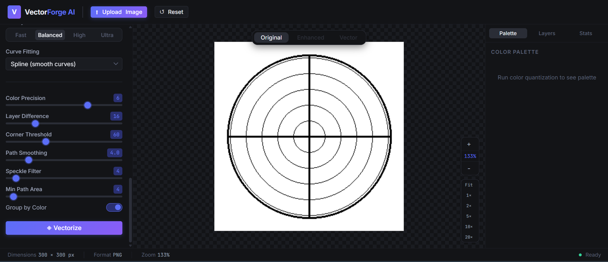
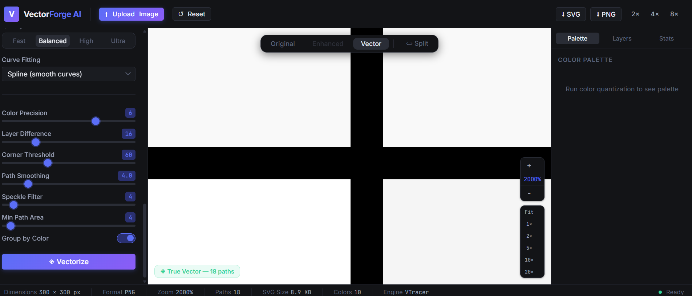
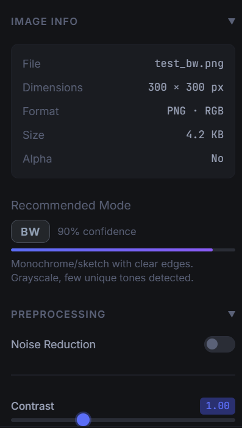
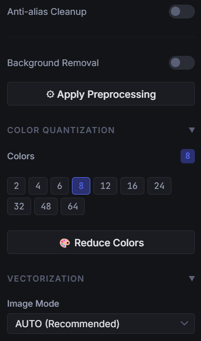
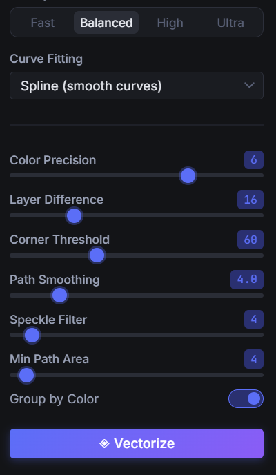
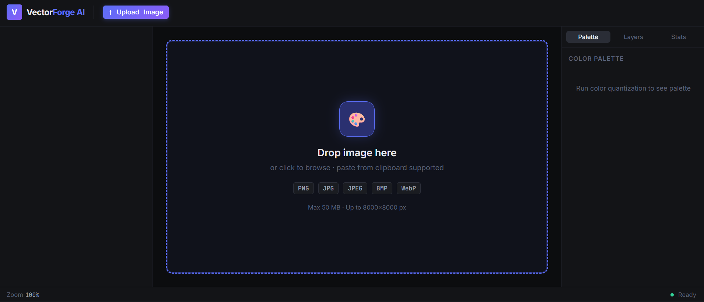
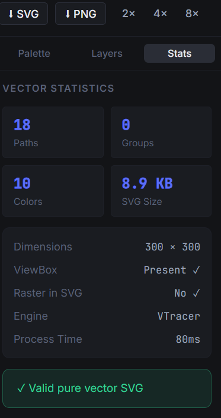

# ⚡ Vectorizer AI

<div align="center">

[](https://python.org)
[](https://fastapi.tiangolo.com)
[](https://react.dev)
[](https://www.typescriptlang.org/)
[](https://github.com/visioncortex/vtracer)
[](LICENSE)
[](https://abidalidev.com)
[](https://github.com/abidalidevv)

**Fix blurry logos, icons, and illustrations. Convert low-res raster images into crisp, infinitely scalable vector graphics (SVG) — 100% locally on your machine.**

[Explore Features](#-key-features) • [Quick Start](#-quick-start-guide) • [Architecture](#-architecture) • [API Reference](#-api-endpoints) • [Developer Guide](CLAUDE.md) • [Portfolio](https://abidalidev.com)

</div>

---

## 🖼️ Visual Showcase

### 🖥️ Full Studio — Raster Image Loaded & Interactive Canvas


### 🔍 2000% Deep Zoom — Pure Scalable Bézier Curves (Zero Pixelation)


### 🎛️ Studio Modules & Feature Breakdown
<div align="center">
  
  
  
</div>

<br />

<div align="center">
  
  
</div>

---

## 💡 Why Vectorizer AI?

Online services like **Vectorizer.io** or subscription-based cloud converters lock vectorization behind paywalls, impose restrictive daily quotas, or transmit sensitive branding and artwork to remote cloud servers.

**Vectorizer AI** provides an open-source, local-first alternative that runs entirely on your own hardware without external API keys or cloud dependencies.

| Feature | Vectorizer AI ⚡ | Vectorizer.io / Cloud Converters ☁️ |
|---|:---:|:---:|
| **Cost & License** | **100% Free & Open Source** (MIT) | Paid Subscription / Pay-per-credit |
| **Privacy & Security** | **100% Local-First** (Zero data leaves device) | Images sent to remote 3rd-party servers |
| **Offline Execution** | ✅ Full offline capability on Windows | ❌ Requires active high-speed internet |
| **Resolution Limit** | ✅ Up to 4096 × 4096 px | ❌ Restricted by tier/credits |
| **Vector Engine** | ✅ High-performance Rust Bézier Engine (VTracer) | Proprietary cloud engine |
| **Color Quantization** | ✅ K-Means Clustering & Median-Cut (2–64 colors) | Fixed server-side palette |
| **SVG Optimization** | ✅ Built-in Scour optimization + standard `viewBox` | Often leaves redundant metadata |
| **PNG Upscaling** | ✅ `resvg` Rust renderer (1×, 2×, 4×, 8×) | Often 1× only or paid extra |

---

## 🚀 Key Features

### 1. Dual Vectorization Engines
- **VTracer Rust Spline Engine**: Fits high-order Bézier curves through color boundaries. Generates buttery-smooth curves without staircasing or visible polygon artifacts.
- **OpenCV Contour Fallback**: High-speed edge contour tracing with `approxPolyDP` simplification for sharp black-and-white logos, technical line art, and typography.
- **Engine Selector**: Automatically selects the best engine based on detected edge density, color count, and image mode.

### 2. Intelligent Pre-Analysis & Mode Recommendation
- Analyzes image complexity using Sobel edge density, color variance, and alpha channel presence.
- Automatically selects the best preset:
  - `Logo / Clipart`: Prioritizes smooth curves, clean color grouping, and low speckle.
  - `Illustration`: Preserves layered color zones and detailed fills.
  - `Sketch / Line Art`: High-contrast thresholding with strict path smoothing.
  - `Black & White`: Crisp binary vectorization without color bleed.
  - `Photo`: High-precision palette clustering for painterly vector art.

### 3. Advanced Image Preprocessing
- **Denoise Filtering**: Bilateral and Gaussian filtering to remove compression artifacts from blurry JPEGs.
- **Contrast & Brightness Tuning**: CLAHE (Contrast Limited Adaptive Histogram Equalization) for dark or low-contrast graphics.
- **Unsharp Mask Sharpening**: Accentuate soft edges before tracing.
- **Connected Background Removal**: Auto-detects background color or lets you sample with adjustable color tolerance.
- **Anti-alias Cleanup**: Binarizes fuzzy boundary pixels for razor-sharp vector cuts.

### 4. Interactive Studio & Canvas
- **Deep Zoom**: Zoom up to **2000%** with zero browser pixelation.
- **Smooth Navigation**: Pan effortlessly with mouse drag or trackpad.
- **Interactive Split Slider**: Drag the split divider to compare original raster vs. vectorized output side-by-side.
- **Interactive Palette**: Inspect detected HEX codes, RGB values, and area percentages.
- **Layer Visibility Toggling**: Show/hide individual color layers directly inside the SVG viewer.

### 5. Multi-Scale Clean Exports
- **SVG Export**: Processed through `scour` to strip redundant tags and enforce standard `viewBox="0 0 W H"` coordinates for web responsiveness.
- **Multi-Scale PNG Export**: Uses `resvg-py` (standalone Rust SVG renderer) to render at 1×, 2×, 4×, and 8× resolutions with transparent or solid background.

### 6. Full Mobile & Tablet Responsiveness
- **Desktop (> 1080px)**: 3-column pro studio layout.
- **Medium Screens (821px–1080px)**: Adaptive compact layout.
- **Mobile & Tablet (<= 820px)**: Sleek segmented workspace navigation (`🎛 Controls`, `👁 Canvas`, `🎨 Layers`), giving each view 100% viewport width without horizontal scrolling.
- **Downward Tooltips**: Tooltips open downwards so they never hide or clip outside the top edge of the browser viewport.

---

## 🏗️ Architecture

```
vectorforge-ai/
│
├── backend/                             # Python 3.14+ FastAPI Server
│   ├── app/
│   │   ├── api/routes/                  # REST API Endpoints
│   │   │   ├── upload.py                # Image validation & session storage
│   │   │   ├── analyze.py               # Edge & color complexity analyzer
│   │   │   ├── preprocess.py            # Denoise, contrast, sharpen, bg-removal
│   │   │   ├── quantize.py              # K-Means & Median-Cut color clustering
│   │   │   ├── vectorize.py             # Tracing pipeline & SVG generator
│   │   │   └── export.py                # SVG optimization & resvg PNG rendering
│   │   ├── image_processing/            # Computer vision modules
│   │   ├── vectorization/               # VTracer (Rust) & Contour (OpenCV)
│   │   ├── export/                      # Scour SVG & resvg-py PNG exporters
│   │   ├── core/                        # SessionManager & App Settings
│   │   └── main.py                      # FastAPI App initialization & CORS
│   └── tests/
│       └── test_vectorforge.py          # Pytest suite (9/9 passing)
│
├── frontend/                            # React 19 + TypeScript + Vite
│   ├── src/
│   │   ├── components/
│   │   │   ├── TopBar.tsx               # Upload, reset, export, and responsive controls
│   │   │   ├── LeftPanel.tsx            # Preprocessing, quantization, and tracing sliders
│   │   │   ├── PreviewCanvas.tsx        # 2000% zoom, pan, and split-view comparison
│   │   │   ├── RightPanel.tsx           # Color palette, layer list, and SVG statistics
│   │   │   ├── DropZone.tsx             # Drag-and-drop & clipboard paste zone
│   │   │   └── StatusBar.tsx            # Dimensions, zoom %, paths, and engine status
│   │   ├── store/appStore.ts            # Zustand global application state
│   │   ├── api/client.ts                # Axios REST client
│   │   └── index.css                    # Dark glassmorphism design system & media queries
│   └── vite.config.ts                   # Vite config with backend proxy
│
├── docs/                                # Technical docs & screenshots
├── samples/                             # Sample images for testing (PNG, WebP, JPG)
├── CLAUDE.md                            # Comprehensive Developer & AI Assistant Guide
├── BRAIN.md                             # Architectural memory & roadmap knowledge base
└── CHANGELOG.md                         # Release history
```

---

## 💻 Installation & Setup

### Prerequisites
- **Operating System**: Windows 10 or 11 (64-bit)
- **Python**: 3.10+ (Tested & verified on Python 3.14.6 AMD64)
- **Node.js**: 18+ (Tested & verified on Node 24+)
- **Git**: Installed

---

### Step 1: Clone Repository
```powershell
git clone https://github.com/abidalidevv/Vectorize-your-image-Fix-and-Convert-Blurry.git
cd Vectorize-your-image-Fix-and-Convert-Blurry
```

---

### Step 2: Set Up Python Backend
```powershell
cd backend

# Create and activate virtual environment (optional but recommended)
python -m venv venv
.\venv\Scripts\Activate.ps1

# Install dependencies
pip install -r requirements.txt
```

---

### Step 3: Set Up Frontend
```powershell
cd ..\frontend

# Install npm dependencies
npm install
```

---

## 🏃 Running the Application

### 1. Start the Backend Server (Port 8000)
```powershell
cd backend\app
python -m uvicorn main:app --host 127.0.0.1 --port 8000 --reload
```
- API Health: `http://127.0.0.1:8000/health`
- Interactive Swagger UI: `http://127.0.0.1:8000/docs`

### 2. Start the Frontend Dev Server (Port 5173)
```powershell
cd frontend
npm run dev
```
- Web Studio: `http://localhost:5173`

---

## 🧪 Testing & Verification

Vectorizer AI includes automated test suites covering all computer-vision pipelines, vectorization engines, and HTTP routes.

```powershell
# Run backend pytest suite (10 tests)
python -m pytest backend/tests/test_vectorforge.py -v

# Run full end-to-end HTTP pipeline test
python tests/test_api_e2e.py

# Build frontend production bundle
cd frontend
npm run build
```

---

## 📡 API Endpoints

| Method | Endpoint | Description |
|---|---|---|
| `GET` | `/health` | Server health check & version info |
| `POST` | `/api/upload` | Multipart upload (PNG, JPG, BMP, WebP) with dimension validation |
| `POST` | `/api/analyze` | Returns edge density, color variance, and recommended mode |
| `POST` | `/api/preprocess` | Applies denoise, contrast, sharpen, or bg-removal |
| `POST` | `/api/quantize` | Reduces color palette using K-Means or Median-Cut |
| `POST` | `/api/vectorize` | Executes VTracer / Contour tracing and returns SVG URL + stats |
| `GET` | `/api/svg/{session_id}` | Serves the generated SVG file directly |
| `POST` | `/api/export/svg` | Exports optimized SVG with `scour` |
| `POST` | `/api/export/png` | Renders high-res raster PNG via `resvg` at 1×, 2×, 4×, 8× |
| `DELETE` | `/api/session/{session_id}` | Cleans up session temporary files |

---

## 🗺️ Roadmap & Future Enhancements

- [x] VTracer Rust curve fitting & Bezier spline tracing
- [x] Intelligent mode analysis & auto-recommendation
- [x] Split-view comparison slider with 2000% zoom
- [x] Mobile & tablet responsive workspace navigation
- [x] High-resolution multi-scale PNG export with `resvg-py`
- [ ] **Batch Processing Mode**: Queue multiple images for bulk vectorization
- [ ] **Desktop App Packaging**: Standalone offline executable using Tauri or Electron
- [ ] **Direct EPS & PDF Vector Export**: Export directly to Adobe Illustrator EPS and print-ready PDF vectors
- [ ] **AI-Assisted Line-Art Inpainter**: Deep-learning edge reconnect for cracked line drawings
- [ ] **WebAssembly In-Browser Tracer**: Client-side WASM engine fallback for serverless hosting

---

## 👨‍💻 Author & Connect

**Abid Ali**  
Full-Stack Engineer & AI Developer  

- 🌐 **Portfolio Website**: [abidalidev.com](https://abidalidev.com)
- 🐙 **GitHub**: [@abidalidevv](https://github.com/abidalidevv)
- 📦 **Repository**: [Vectorize-your-image-Fix-and-Convert-Blurry](https://github.com/abidalidevv/Vectorize-your-image-Fix-and-Convert-Blurry)

---

## 📄 License

This project is licensed under the [MIT License](LICENSE) — free for personal and commercial use.
